```{r}
#| echo: false
#| message: false
#| warning: false
library("gt")
library("tidyverse")

# topics_df <- readr::read_csv("SML_301_lecture_schedule.csv")
```

# Session 1: Introductions

## Start

:::: {.columns}

::: {.column width="60%"}
* **Goal**: Introduce course

* **Objective**: Describe types of learning
:::

::: {.column width="40%"}
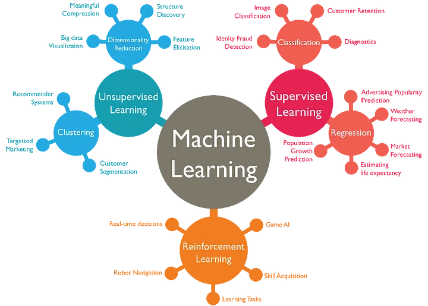

image source: [Sankalp Salve](https://medium.com/@xsankalp13/advanced-topics-in-machine-learning-e55d8b0dc7f9)

:::

::::


# SML 301

## Data Intelligence: Modern Data Science Methods 

* Fall 2026
* Monday, Wednesday, 1040 AM to 12 noon
* Lecturer: Derek Sollberger

    - I go by "Derek" or "teacher"
    - office hours: 
      - Mon, 2 to 4 PM
      - Bendheim House 201

::: {.callout-tip collapse="true"}
## Course Description

This course provides the training for students to be independent in modern data analysis. The course emphasizes the rigorous treatment of data and the programming skills and conceptual understanding required for dealing with modern datasets. The course examines data analysis through the lens of statistics and machine learning methods. Students verify their understanding by working with real datasets. The course also covers supporting topics such as experiment design, ethical data use, best practices for statistical and machine learning methods, reproducible research, writing a quantitative research paper, and presenting research results.
:::

# Introducting the Presenter

## Lecturer

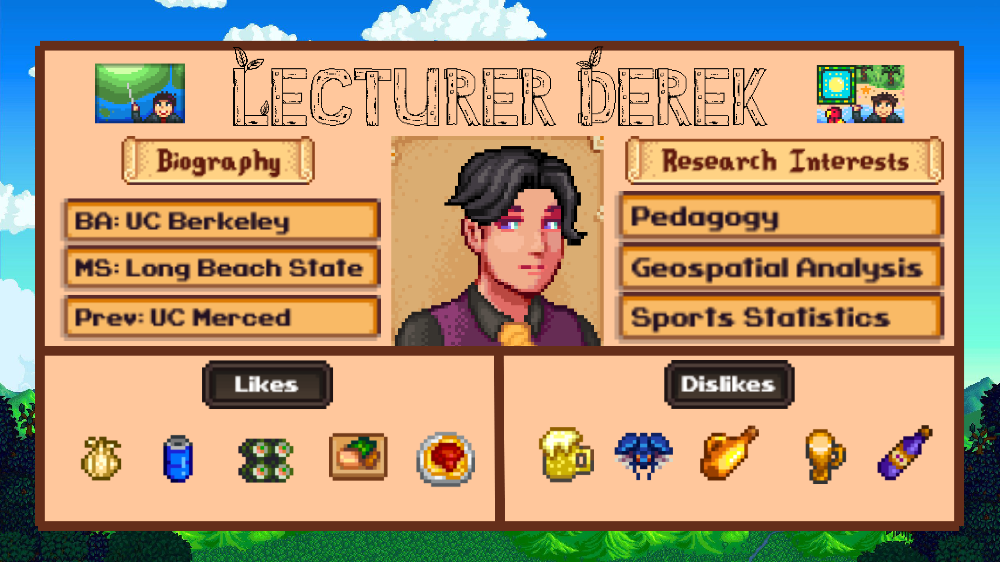


## Current Research in Pedagogy

:::: {.columns}

::: {.column width="50%"}
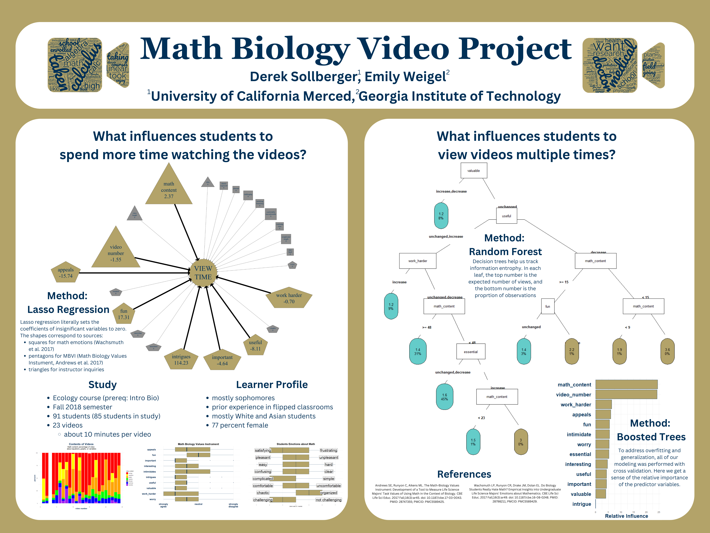
:::

::: {.column width="50%"}
- active learning
- computer programming
- flipped classrooms
:::

::::

# Activity: Icebreaker

1. What is one of your unusual goals?

    - What drives you? What makes you unique?
    - (Please pick a goal other than "get good grades")
    - For whatever time frame makes sense
2. What is something that you are hoping to gain from this SML 301 course?
3. Favorite food?

    
::: {.callout-tip collapse="true"}
## Derek's Example2

1. (unusual goal) I hope to attend more Princeton sports games
2. This semester, I will learn more about GeoAI (artificial intelligence for geospatial calculations)
3. Sushi!
:::

::: {.callout-warning collapse="true"}

## DCP 1

DCP 1

:::

# Reading List

## Textbooks

:::: {.panel-tabset}

### General

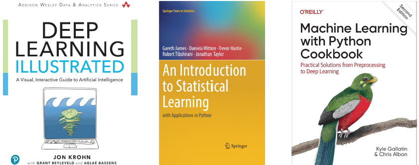

* *Deep Learning Illustrated* Jon Krohn et al
* *ISLP* James, Witten, Hastie, Tibshirani, Taylor
* *ML Cookbook* Gallatin, Albon

### Enthusiasts

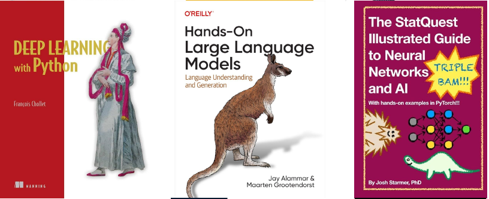

* *DL with Python* Francois Chollet
* *Hands-On LLMs* Allammar, Grootendorst
* *StatQuest AI* Josh Starmer

### Cerebral

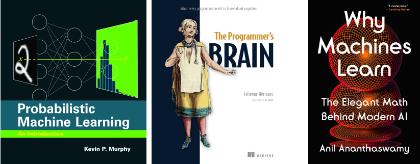

* *Probabilistic ML* Kevin P Murphy
* *Programmer’s Brain* Felienne Hermans
* *Why Machines Learn* Anil Ananthaswamy

### Humanities

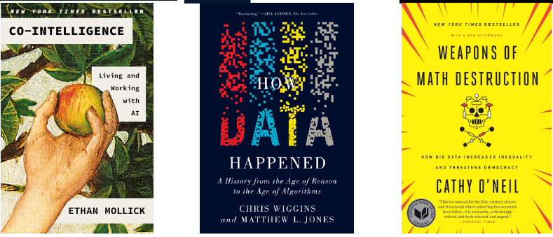

* *Co-Intelligence* Ethan Mollick
* *How Data Happened* Wiggins, Jones
* *Weapons of Math* Destruction Cathy O’Neil

### Ethics

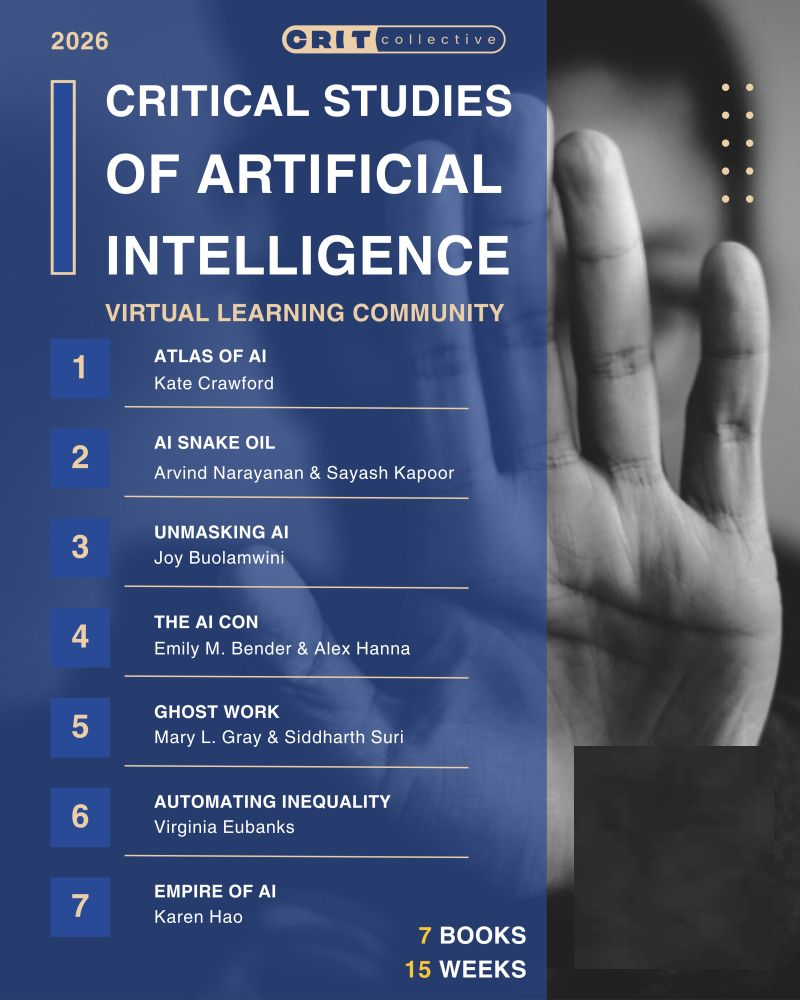

### all

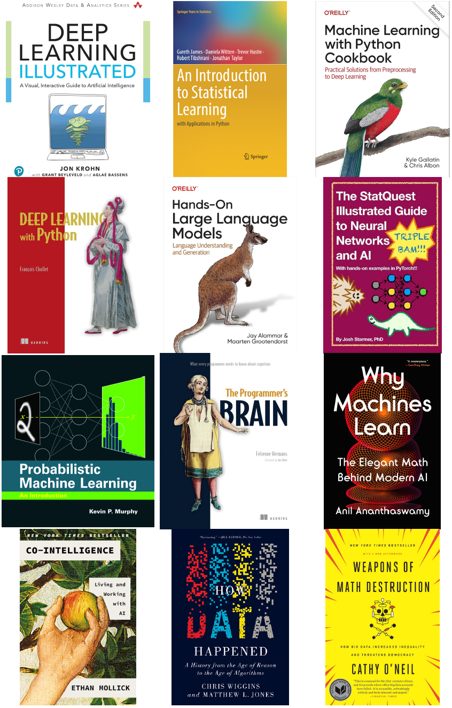

::::


# Administrative

::: {.callout-warning collapse="true"}

## Prerequisites

* One semester of data science and statistics
* Two semesters of calculus
* Familiarity with R or Python programming is assumed

:::

::: {.callout-note collapse="true"}

## Course Learning Outcomes

By the end of this course, students will be able to:

* Understand the main concepts of machine learning in supervised learning, unsupervised learning, and reinforcement learning
* Deploy and experiment with various machine learning algorithms
* Critique results and performance of machine learning computations
* Refine artificial intelligence code and discuss parameter selection
* Understand the ethical and societal implications of artificial intelligence, including issues such as algorithmic bias, data privacy, and the impact of automation

:::

::: {.callout-note collapse="true"}

## Lecture Sessions

Please keep extra noise to a minimum.  Cell phones may be used as long as they are on silent or vibrate.  Please also review the Cooperative Classroom statement below.

:::

::: {.callout-note collapse="true"}

## Precepts

Precepts will be held for 80 minutes per week.  Students will develop problem-solving skills through collaborative work on the computer programming  while also working toward the projects.

Upon completing precept work, either

* ask an instructor to check your work for credit in your precept section
* or, if otherwise submitting online, upload the HTML file back in Canvas

:::

::: {.callout-note collapse="true"}

## Late Policy

Most assignments will be due at 5 PM USA Eastern time on Friday.  Credit for late assignments may be deducted 10 percent (from the maximum point total), plus another 10 percent for each additional 12-hour period after the stated due date.

:::

::: {.callout-note collapse="true"}

## Computers

Use of a laptop computer is highly recommended for this course, and students are asked to bring their laptop computer to every lecture and precept session.

* More information about computer needs can be found at <https://princeton.service-now.com/service?id=kb_article&sys_id=KB0013768>
* While Chromebooks (or other systems that discourage installation of software) can access cloud software, intensive calculations in this course may merit the use of a personal computer and downloaded software rather than server access.

:::

::: {.callout-tip collapse="true"}

## Special Accommodations

Students must register with the Office of Disability Services (ODS) (ods@princeton.edu; 258-8840) for disability verification and determination of eligibility for reasonable academic accommodations. Requests for academic accommodations for this course need to be made at the beginning of the semester, or as soon as possible for newly approved students, and again at least two weeks in advance of any needed accommodations in order to make arrangements to implement the accommodations. Please make an appointment to meet with me in order to maintain confidentiality in addressing your needs. No accommodations will be given without authorization from ODS, or without advance notice.

:::

::: {.callout-important collapse="true"}

## Academic Integrity Policy 

You are allowed to read text books and resources online. You may not ask other individuals questions (e.g., you may not ask questions on Stack Exchange or Python help discussion groups). 

You may use artificial intelligence chatbots (e.g. ChatGPT, Claude) as a resource or study aid to review course ideas.  Do not use these chatbots to generate code for assignments.

In accordance with the honor code, you must cite all sources of external information used in your work. This can be a book or a web site. Part of being a successful data scientist is having the ability to leverage existing information and techniques, so it is okay to do so in this course as long as you cite the reference.  University policies can be reviewed at <https://ua.princeton.edu/policies-resources/undergraduate-honor-system>

:::

::: {.callout-note}

## Generative AI Usage by Students

My general guidance for students in SML 301 is that it is permitted to use artificial intelligence tools such as ChatGPT or Claude large-language models (LLMs) to coach on broad concepts. Students may not have software answer homework or project tasks directly. Students may not upload data sets, exercise questions, data visualization, or model results into LLMs.

Permitted discourse includes

* “How do I make a bar chart in Python and Matplotlib?”
* “Can you help me understand the concept of collinearity?”
* “For exam preparation, create some multiple-choice questions about machine learning”

Prohibited discourse includes:

* “Use this data set and give me summary statistics of the columns”
* “Summarize this graph and give me advice on how to improve it”
* “From the model results, how do we describe the goodness of fit?”

:::

::: {.callout-tip collapse="true"}

## Generative AI Usage from Instructors

Here I want to disclose how the teaching staff may use artificial intelligence tools over the semester.

* Responses for ‘During Class Prompts’ will be summarized through an AI technique called Topic Modeling
* Gradescope submissions are collected and grouped by similar responses and handwriting to speed up grading of common answers.
* Instructors use open-source foundation models offline to ensure student work will not be disseminated to the wider internet nor used to train future foundation models.
* Project data scenarios may be explored through literature searches to see how other researchers approached the data.

:::


# Topics

::::: {.panel-tabset}

## first half

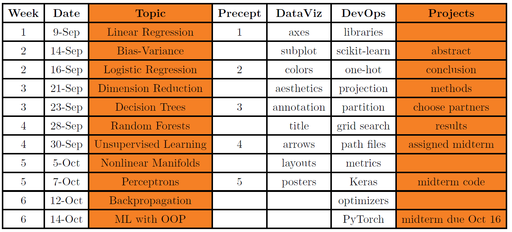

## second half

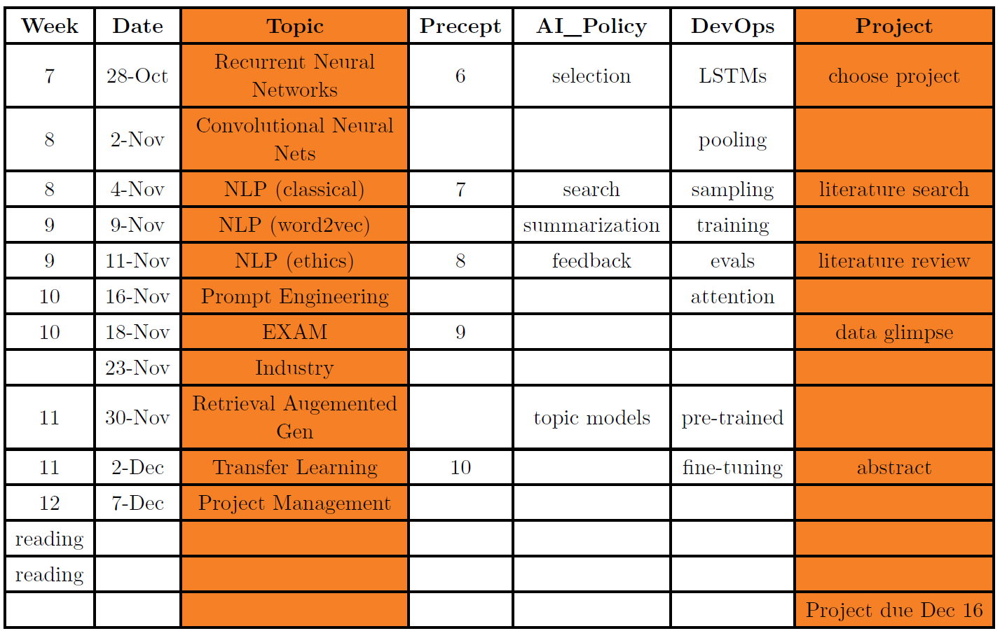

:::::


# Supervised Learning

Today's big ideas:

* supervised learning vs unsupervised learning
* regression versus classification

::: {.callout-note collapse="true"}

## Supervised Learning

**Supervised Learning** algorithms act on *labeled data* (where we know the outcomes of the *training* and *testing* data).

Example techniques:

* regression models
* decision trees

:::

::: {.callout-note collapse="true"}

## Unsupervised Learning

For **unsupervised Learning**, we tend to seek to discover structure within *unlabeled data*.

Example techniques:

* clustering
* K Nearest Neighbors

:::

::: {.callout-tip}

## Regression

**Regression models** take data and output a *numerical outcome*

:::

::: {.callout-tip}

## Classification

**Classification models** take data and output a *categorical label*

:::

::: {.callout-warning collapse="true"}

## On that nomenclature

Those definitions above for regression and classifications are colloquial guidelines, and they do not apply to every situation.

For example, *logistic regression* technically predicts a number, but it is used in classification contexts.

:::

# Activity: A short Python tutorial

To the best of your present knowledge, what do each of the following lines of Python code do? What is the code output (if applicable)?

* section 2.3.3 of *Introduction to Statistical Learning in Python*

```
import numpy as np
x = np.array([3, 4, 5])
y = np.array([4, 9, 7])
x + y
```

```
x = np.array([[1, 2], [3, 4]])
#array([[1, 2],
#[3, 4]])
x.ndim
x.shape
```

```
x.dtype
np.array([[1, 2], [3.0, 4]]).dtype
```

```
x = np.array([1, 2, 3, 4])
x.sum()
x**2
x**0.5
```
::: {.callout-warning collapse="true"}

# DCP 2

DCP 2

:::


# Learning Environment

::: {.callout-tip collapse="true"}

## Cooperative Classroom

Learning in a cooperative environment should be stimulating, demanding, and fair.  Because this approach to learning is different from the competitive classroom structure that many other courses used to be based on, it is important for us to be clear about mutual expectations.  Below are my expectations for students in this class.  This set of expectations is intended to maximize debate and exchange of ideas in an atmosphere of mutual respect while preserving individual ownership of ideas and written words.  If you feel you do not understand or cannot agree to these expectations, you should discuss this with your instructor and classmates.

1.	Students are expected to work cooperatively with other members of the class and show respect for the ideas and contributions of other people.
2.	When working as part of a group, students should strive to be good contributors to the group, listen to others, not dominate, and recognize the contributions of others.  Students should try to ensure that everyone in the group is welcome to contribute and recognize that everyone contributes in different ways to a group process.
3.	Students should explore data, make observations, and develop inferences as part of a group.  If you use material from published sources, you must provide appropriate attribution.

:::: {.columns}

::: {.column width="50%"}
(Students will be asked to acknowledge this document in an online form.)

This document has been adapted from
*Scientific Teaching*
by Jo Handelsman, Sarah Miller, and Christine Pfund
:::

::: {.column width="50%"}
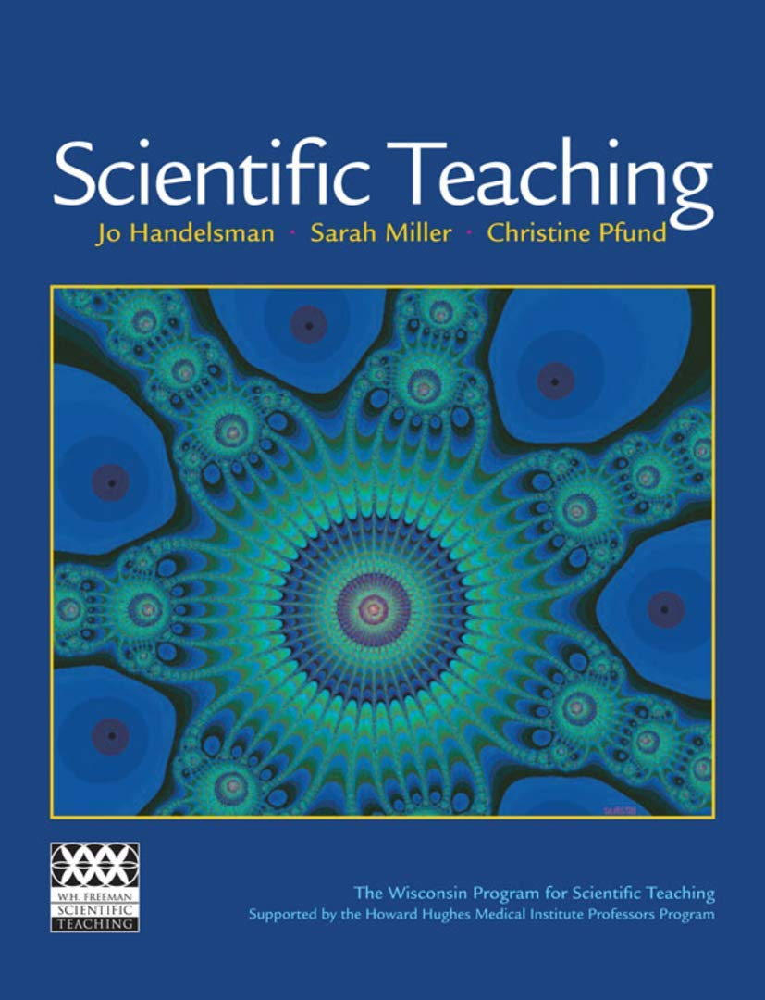
:::

::::

:::

::: {.callout-tip collapse="true"}

## Pep Talk

Learning R can be difficult at first---it is like learning a new language, just like Spanish, French, or
Chinese. Hadley Wickham---the chief data scientist at RStudio and the author of some amazing R packages you will be using like `ggplot2`---made this wise observation:

> It's easy when you start out programming to get really frustrated and think, “Oh it's me, I'm really stupid,” or, “I'm not made out to program.” But, that is absolutely not the case. Everyone gets frustrated. I still get frustrated occasionally when writing R code. It's just a natural part of programming. So, it happens to everyone and gets less and less over time. Don't blame yourself. Just take a break, do something fun, and then come back and try again later.

If you are finding yourself taking way too long hitting your head against a wall and not understanding, take a break, talk to classmates, ask questions ... e-mail [Derek], etc.  I promise you can do this.

---Andrew Heiss, Georgia State University   

:::

::: {.callout-tip collapse="true"}

## Inclusion Statement

I value all students regardless of their background, country of origin, race, religion, ethnicity, gender, sexual orientation, disability status, etc. and am committed to providing a climate of excellence and inclusiveness within all aspects of the course. If there are aspects of your culture or identity that you would like to share with me as they relate to your success in this class, I am happy to meet to discuss. Likewise, if you have any concerns in this area or facing any special issues or challenges, you are encouraged to discuss the matter with me (set up a meeting by e-mail) with an assurance of full confidentiality (only exception being mandatory reporting of academic integrity code violations or sexual harassment).

:::


# Learner Profiles

:::: {.panel-tabset}

## Pedagogy

Sharing an overview of the types of students that might be taking this course.

## 1

:::: {.columns}

::: {.column width="45%"}
### Spike


:::

::: {.column width="10%"}
	
:::

::: {.column width="45%"}
* Senior
* ORFE
* Looking to add a variety of skills toward software development
:::

::::

## 2

:::: {.columns}

::: {.column width="45%"}
### Jet

	
:::

::: {.column width="10%"}
	
:::

::: {.column width="45%"}
* Junior
* Psychology
* Took AP Statistics years ago and a data science course
:::

::::

## 3

:::: {.columns}

::: {.column width="45%"}
### Faye

		
:::

::: {.column width="10%"}
	
:::

::: {.column width="45%"}
* Sophomore
* Anthropology
* Wants to add "machine learning" to CV before applying to internships
:::

::::

## 4

:::: {.columns}

::: {.column width="45%"}
### Ed

		
:::

::: {.column width="10%"}
	
:::

::: {.column width="45%"}
* Computer Science
* Has a lot of experience programming in Python and VS Code, and is looking for larger projects 
:::

::::

::::


# Ethics Enclave: Boom or Doom

::::: {.panel-tabset}

## meme

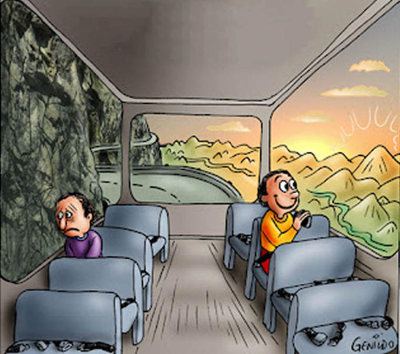

* image source: [Know Your Meme](https://knowyourmeme.com/photos/2252775-two-guys-on-a-bus)

## boomer

:::: {.columns}

::: {.column width="45%"}
> The accelerationist fantasy has a particularly libertarian bent: it sees unfettered markets as the means to generate unlimited energy and solutions to social problems.  And it sees AI as a central part of this equation.

--- *The AI Con*, page 147
:::

::: {.column width="10%"}
	
:::

::: {.column width="45%"}

:::

::::


## doomer

:::: {.columns}

::: {.column width="45%"}
	
:::

::: {.column width="10%"}
	
:::

::: {.column width="45%"}
> AI Doomerism is the belief that, at some point, we will build an AI system powerful enough that it results in a mass extinction event.

--- *The AI Con*, page 139
:::

::::

## between

> Doomerism/Boosterism serves to obscure, rather than illuminate, what's at stake when it comes to the current AI boom.

--- *The AI Con*, page 139

:::::


# Activity: TF Playground

:::: {.columns}

::: {.column width="60%"}

## TensorFlow Playground

* link: [https://playground.tensorflow.org](https://playground.tensorflow.org)
* explore the various menus and buttons
* feel free to run a simulation

:::

::: {.column width="10%"}
	
:::

::: {.column width="30%"}
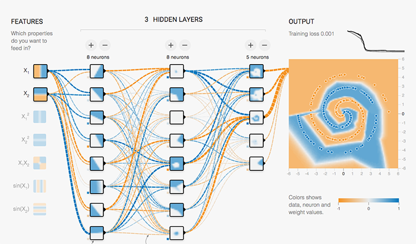
:::

::::

::: {.callout-warning collapse="true"}

# DCP 3

DCP 3

:::

# Semester Projects

::::: {.panel-tabset}

## Overview

For SML 301, students will complete a substantial machine learning project

- exploration of an image data set
- fine tuning a pre-trained model
- neural network hyperparameter tuning
- machine learning modeling
- video presentation
- research poster/slides

You (and your group) may select one of the [Roboflow computer vision datasets](https://public.roboflow.com/) (that was not used during class or precepts)

* or you may propose your own project (please do so before Fall Break)

## CNN

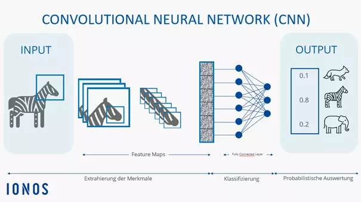

* image source: [IONOS](https://www.ionos.com/digitalguide/websites/web-development/convolutional-neural-networks/)

## Fine Tuning

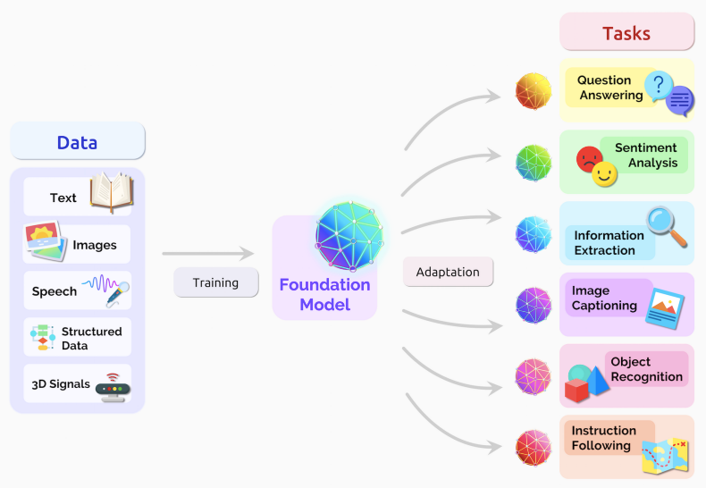

* image source: [Labeller](https://www.labellerr.com/blog/beginners-guide-using-foundation-models-in-ml-projects/)

## RoboFlow

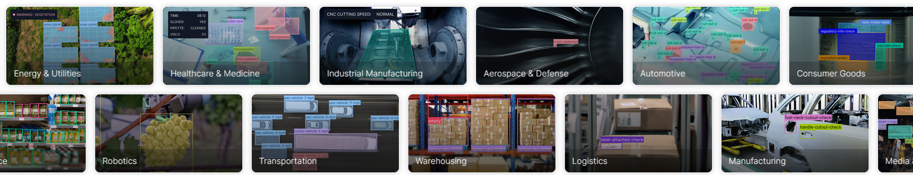

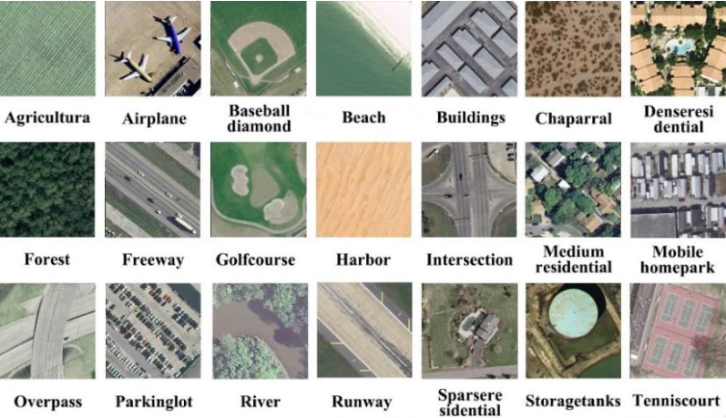

:::::

# Motivation

::::: {.panel-tabset}

## CLOs

* Understand the main concepts of machine learning in supervised learning, unsupervised learning, and reinforcement learning
* Deploy and experiment with various machine learning algorithms
* Critique results and performance of machine learning computations
* Refine artificial intelligence code and discuss parameter selection
* Understand the ethical and societal implications of artificial intelligence, including issues such as algorithmic bias, data privacy, and the impact of automation

## Skills

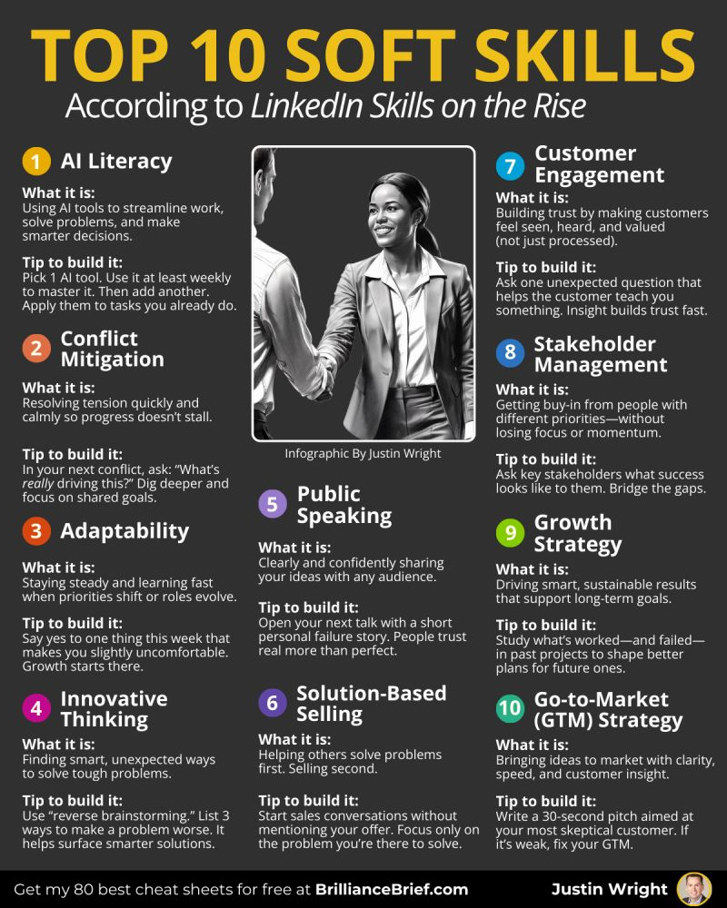

## Engineering

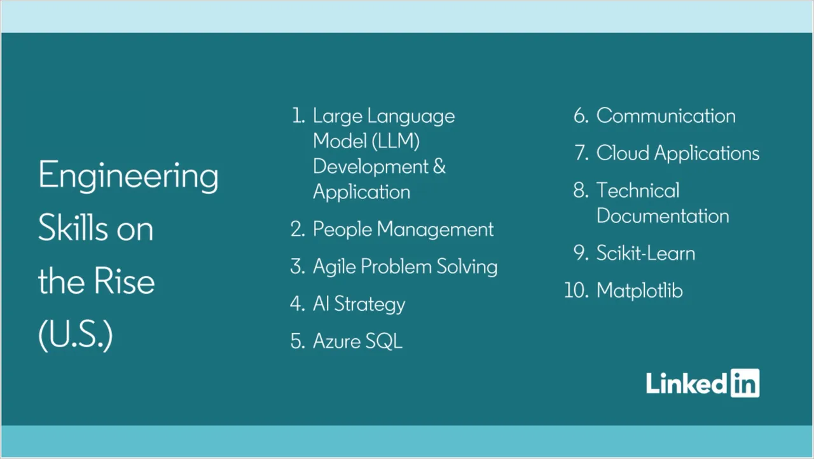

## Resilience

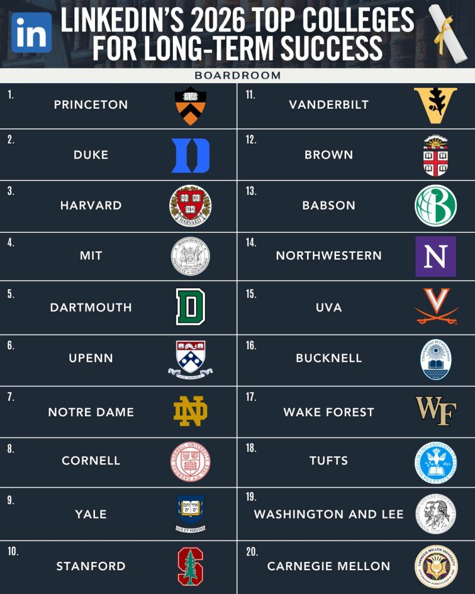

* source: [LinkedIn](https://news.linkedin.com/2026/linkedin-top-colleges-2026-the-50-best-colleges-for-long-term-career-success-in-the-us)
* image source: [Yovany Jerez](https://www.linkedin.com/feed/update/urn:li:activity:7499220170649784320/)

:::::


# Quo Vadimus?

:::: {.columns}

::: {.column width="45%"}
* No precept sections for SML 301 this week

    * Precepts will start on Sept 9 and 10
    
* due next Friday (Sept 11):

    - Precept 1
    - CLO Assessment (survey)

* If you are not yet enrolled in this course, please sign in

:::

::: {.column width="10%"}
	
:::

::: {.column width="45%"}
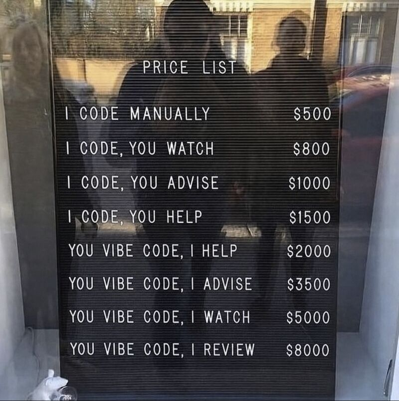

* image source: [Leonard Thiele](https://www.linkedin.com/feed/update/urn:li:activity:7497661533796085761/)

:::

::::


# Footnotes

::: {.callout-note collapse="true"}

## (optional) Additional Resources


:::

::: {.callout-note collapse="true"}
## Session Info

```{r}
sessionInfo()
```
:::


:::: {.columns}

::: {.column width="45%"}
	
:::

::: {.column width="10%"}
	
:::

::: {.column width="45%"}

:::

::::

::::: {.panel-tabset}


:::::