```{r}
#| echo: false
#| message: false
#| warning: false

library("gt")
library("palmerpenguins")
library("tidyverse")

penguins_df <- penguins |>
  mutate(pid = 1:nrow(penguins), .before = species)
```

# Session 7: Random Forests

## Learning objectives:

:::: {.columns}

::: {.column width="45%"}
- Deploy many decision trees
- Explore ensemble learning:

    - bagging
    - boosting
:::

::: {.column width="10%"}

:::

::: {.column width="45%"}
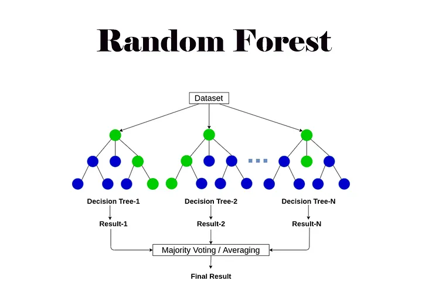

* image credit: [Abhishek Jain](https://medium.com/@abhishekjainindore24/everything-about-random-forest-90c106d63989)
:::

::::

::: {.callout-note}
## Overfitting

When we are improving (by metric) in modeling over the training data and yet are performing worse with the test data, we are probably **overfitting** the data.

That is, the machine learning is memorizing the training data, but is not generalizing well to new data.

:::

::: {.callout-warning}
## Inaccurate Decision Trees

Decision trees

* pro: interpretable
* con: prone to overfitting

:::


# Random Forests

::: {.callout-note}
## Random Forests

In order to mitigate overfitting, we can deploy a **random forest** consisting of many decision trees.

* pruning trees (i.e. limit max depth)
* subsets of explanatory variables
:::

::: {.callout-warning}
# DCP1
:::

# Bagging

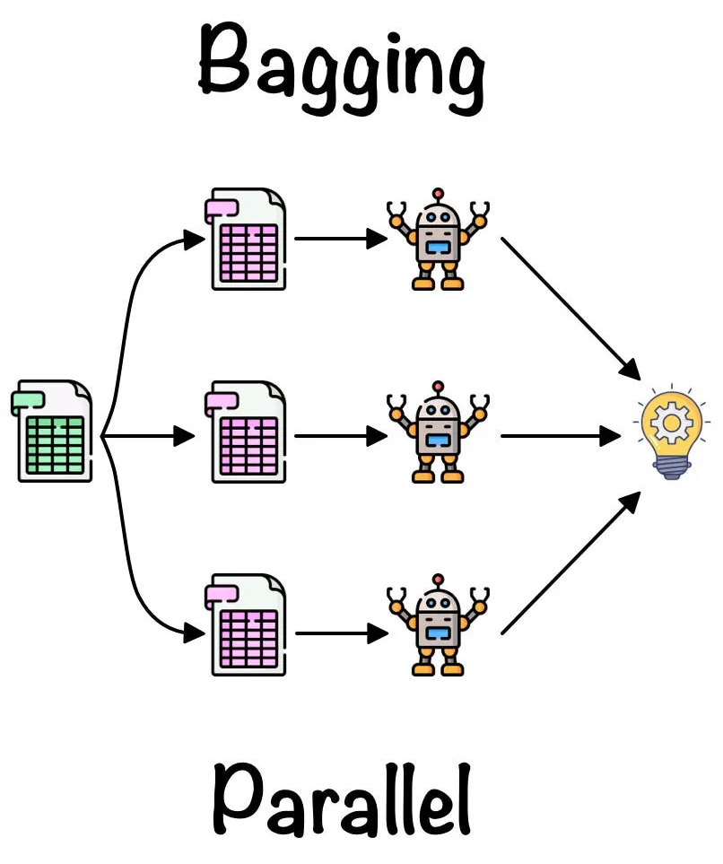

* image source: [Roshmita Dey](https://medium.com/@roshmitadey/bagging-v-s-boosting-be765c970fd1)

## Bootstrapping

**Bootstrapping** is performed by *resampling with replacement* on the data.

```{r}
#| echo: false
set.seed(301)
penguins_resampled <- penguins_df |>
  sample_frac(1.0, replace = TRUE)

small_bag <- penguins_resampled |>
  slice(1:10) |>
  select(pid, species, island)

set.seed(301)
small_bag_resampled <- small_bag |>
  sample_frac(1.0, replace = TRUE)

in_bag_IDs <- small_bag_resampled |>
  select(pid) |>
  distinct() |>
  pull(pid)
```


:::: {.columns}

::: {.column width="45%"}
```{r}
#| echo: false

small_bag |>
  gt() |>
  tab_header(
    title = "Sample",
    subtitle = "of 10 penguins"
  ) |>
  tab_style(
    style = cell_fill(color = "lightblue"),
    locations = cells_body(rows = pid %in% in_bag_IDs)
  ) |>
  tab_style(
    style = cell_fill(color = "violetred1"),
    locations = cells_body(rows = !(pid %in% in_bag_IDs))
  )
```

:::

::: {.column width="10%"}
	
:::

::: {.column width="45%"}
```{r}
#| echo: false

small_bag_resampled |>
  gt() |>
  tab_header(
    title = "Resample",
    subtitle = "of 10 penguins"
  ) |>
  tab_style(
    style = cell_fill(color = "lightblue"),
    locations = cells_body(rows = pid %in% in_bag_IDs)
  ) |>
  tab_style(
    style = cell_fill(color = "violetred1"),
    locations = cells_body(rows = !(pid %in% in_bag_IDs))
  )
```
:::

::::

## Bags

### 10 Penguins

:::: {.columns}

::: {.column width="45%"}
### In-Bag

```{r}
#| echo: false

small_bag |>
  filter(pid %in% in_bag_IDs) |>
  gt() |>
  tab_header(
    title = "In-Bag",
    subtitle = "from 10 penguins"
  ) |>
  tab_style(
    style = cell_fill(color = "lightblue"),
    locations = cells_body(rows = pid %in% in_bag_IDs)
  ) |>
  tab_style(
    style = cell_fill(color = "violetred1"),
    locations = cells_body(rows = !(pid %in% in_bag_IDs))
  )
```

:::

::: {.column width="10%"}
	
:::

::: {.column width="45%"}
### Out-of-Bag

```{r}
#| echo: false

small_bag |>
  filter(!(pid %in% in_bag_IDs)) |>
  gt() |>
  tab_header(
    title = "Out-of-Bag",
    subtitle = "from 10 penguins"
  ) |>
  tab_style(
    style = cell_fill(color = "lightblue"),
    locations = cells_body(rows = pid %in% in_bag_IDs)
  ) |>
  tab_style(
    style = cell_fill(color = "violetred1"),
    locations = cells_body(rows = !(pid %in% in_bag_IDs))
  )
```
:::

::::

### 344 Penguins

:::: {.columns}

::: {.column width="45%"}
### In-Bag

```{r}
#| echo: false
print(sort(unique(penguins_resampled$pid)))
```
	
:::

::: {.column width="10%"}
	
:::

::: {.column width="45%"}
### Out-of-Bag

```{r}
#| echo: false
out_bag_df <- penguins_df |>
  anti_join(penguins_resampled, by = "pid")
print(sort(unique(out_bag_df$pid)))
```
:::

::::

::: {.callout-tip}
## Bagging

Decision trees

**Bagging** is using the notion of **b**ootstrapping to **agg**regate the data.

* In general, about 1/3 of the data falls into the *out-of-bag* category
* For each resampling, we can create a decision tree with the *in-bag* sample
* We can use the out-of-bag data as a testing set

    * **out-of-bag error** (OOB error)

:::


::: {.callout-note}
## Ensemble Reconstruction

* For classification tasks, after making a random forest (say, 1000 trees), class labels are assigned by the majority of predictions.
* For regression tasks, we can average the prediction results from the trees

:::


::: {.callout-tip collapse="true"}
## Variable Importance

Since we have created many trees---each choice order determined by entropy---we can create a list of *variable importance* by reporting which explanatory variables appeared in a higher proportion of trees.  This could aid in variable selection and interpretability.

:::


::: {.callout-warning}
# DCP2

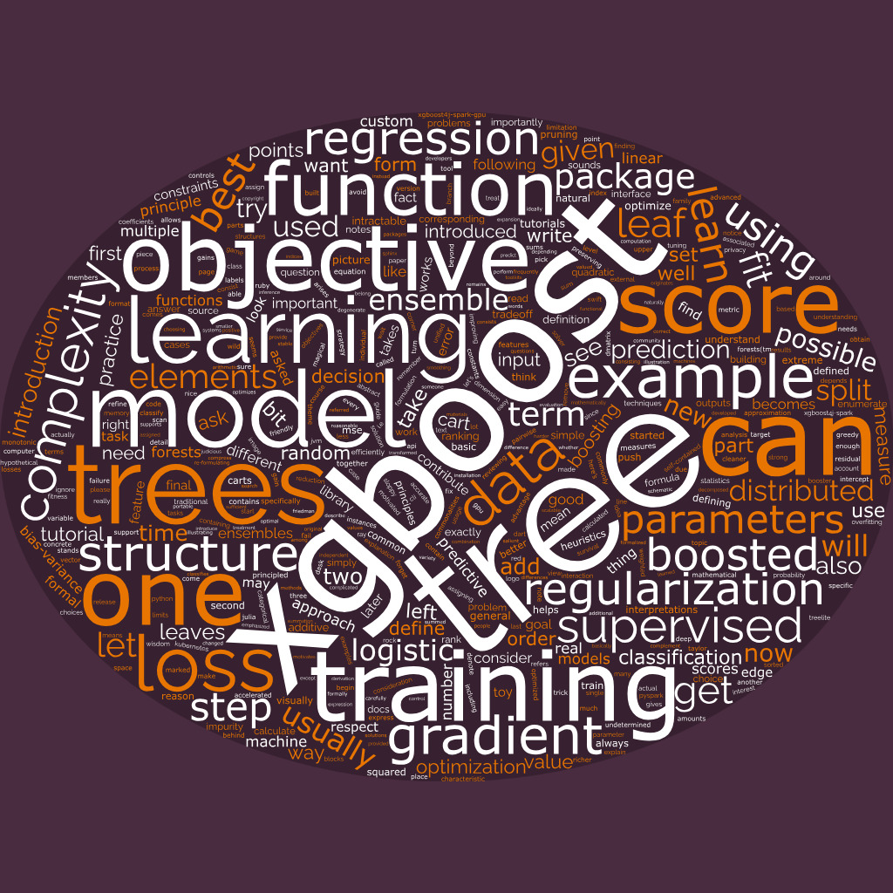
:::

# Boosting

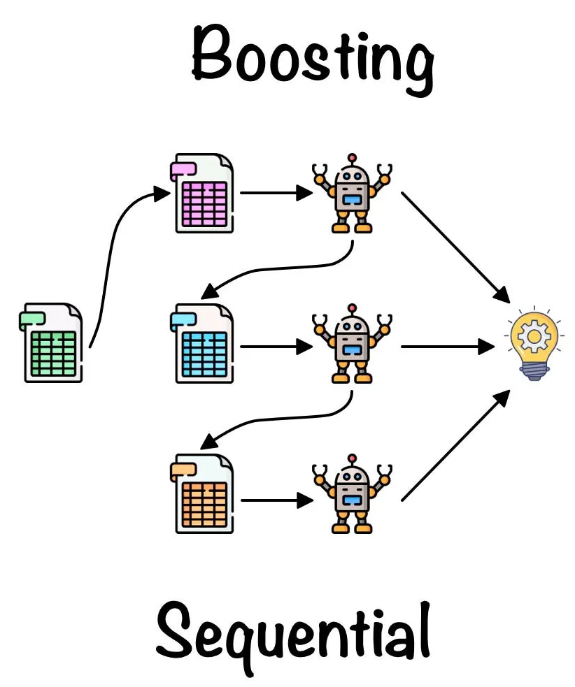

* image source: [Roshmita Dey](https://medium.com/@roshmitadey/bagging-v-s-boosting-be765c970fd1)

::: {.callout-note}
## Boosting

For tree models, **boosting** resamples underrepresented data and applies larger weights to aim toward stratified sampling.
:::

## Stratified Samples

> For **stratified sampling**, subsets maintain proportions of categorical data.

For example, 88 percent of people are right-handed. We assume population proportions

$$p = 0.88, \quad 1 - p = 0.12$$

If we employ a training-testing split, each should also have approximately 12 percent representation for left-handed people.

## Rescaling

> If a sample data set exhibits different proportions, we can perform **inverse probability weighting** to try to correct for bias in the sample.

For example, if our tree model predicts 70 percent right-handed people, then we can apply some weights

* on right-handed: weight = $\frac{0.88}{0.70} \approx 1.2571$
* on left-handed: weight = $\frac{0.12}{0.30} = 0.4$

# AdaBoost (1996)

::::: {.panel-tabset}

## Intro

:::: {.columns}

::: {.column width="45%"}
* developed at Bell Labs, NJ
* presented in 1996
* strategy for allocation between choices
* [paper](https://link.springer.com/chapter/10.1007/3-540-59119-2_166)
:::

::: {.column width="10%"}
	
:::

::: {.column width="45%"}
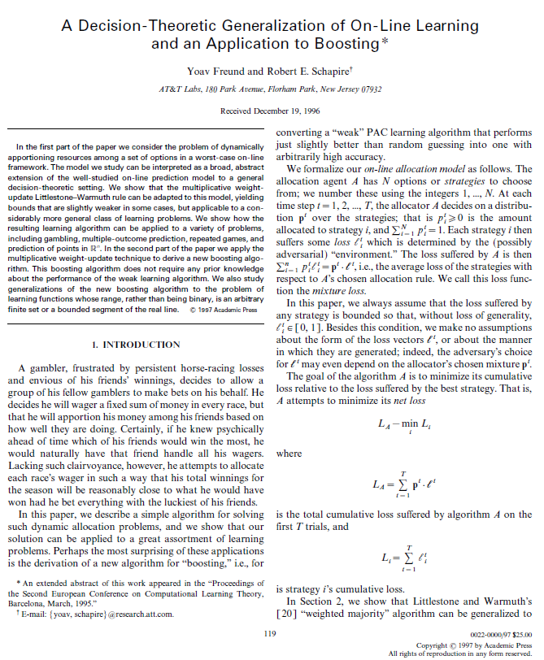
:::

::::

## Conclusion

:::: {.columns}

::: {.column width="45%"}
* algorithm in pseudocode
* uses "Weak Learners"
* applies to piecewise linear functions (such as decision trees)
:::

::: {.column width="10%"}
	
:::

::: {.column width="45%"}
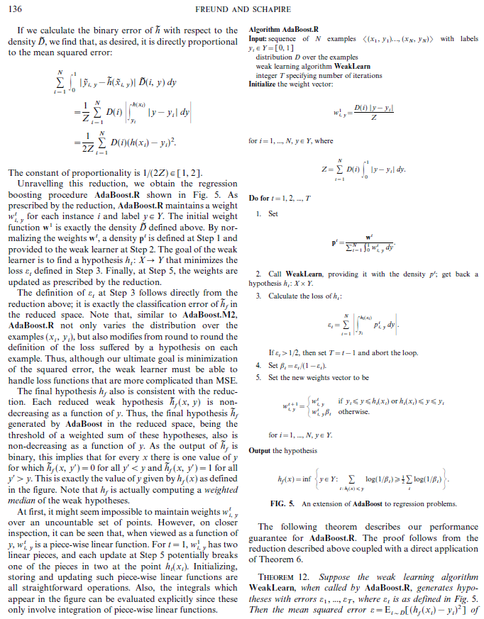
:::

::::

## Methods

:::: {.columns}

::: {.column width="45%"}
* each "weak learner" is, later, a "stump" (a decision tree of depth one)
* errors from each stump is used in the calculation for the weight of the next stump
* one variable at a time
:::

::: {.column width="10%"}
	
:::

::: {.column width="45%"}
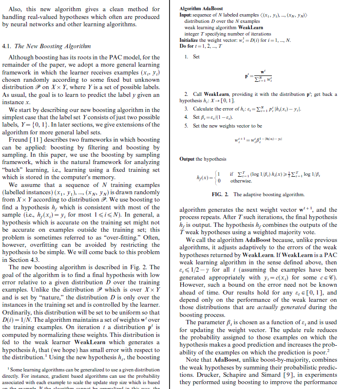
:::

::::

## Results

:::: {.columns}

::: {.column width="45%"}
Not only does this process small errors after the creation of many trees (on the training data), the theorems allow us to estimate the *generalization error* (on the test data)
:::

::: {.column width="10%"}
	
:::

::: {.column width="45%"}
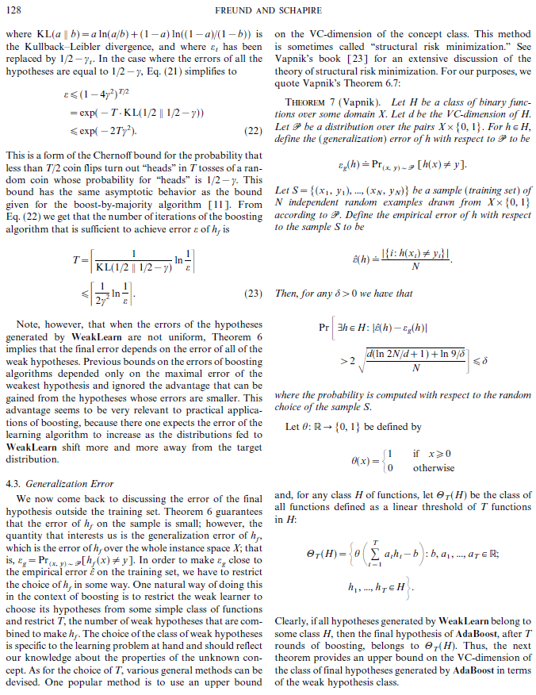
:::

::::

:::::


# Ethics Enclave: Image Alterations

:::: {.columns}

::: {.column width="45%"}
> Ramirez told the Review that he initially “found it hilarious” that the school had used AI to change the photo. “But after looking at the comparison, I was also upset because I don’t agree with Stanford making those choices about how we were represented,” he said. 

* image source: [NY Times](https://www.nytimes.com/2026/09/22/us/stanford-photo-swap-black-hispanic-student.html)
* news source: [NBC News](https://www.nbcnews.com/news/us-news/stanford-apologizes-saying-ai-altered-pic-changed-students-gender-race-rcna599691), September 24, 2026
:::

::: {.column width="10%"}
	
:::

::: {.column width="45%"}

:::

::::

::: {.callout-warning}
# DCP3
:::

# XGBoost (20166)

::::: {.panel-tabset}

## Intro

:::: {.columns}

::: {.column width="45%"}
* emphasis on sparse-aware and scalable boosting
* improving upon previous boosting techniques such as Gradient Boosting Machine (GBM)
* [paper](https://arxiv.org/pdf/1603.02754) by Tianqi Chen and Carlos Guestrin (2016)
:::

::: {.column width="10%"}
	
:::

::: {.column width="45%"}
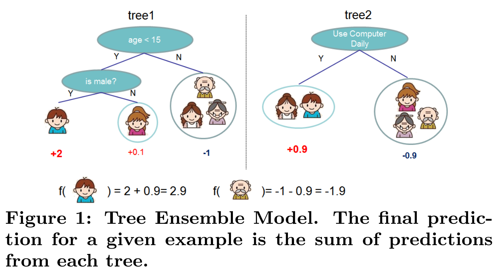
:::

::::

## Methods

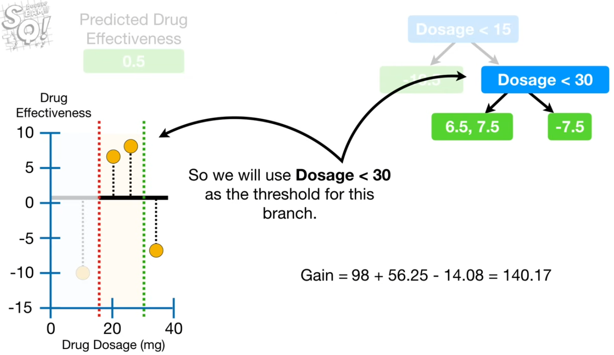

* metrics: gain/similarity for regression/classification
* multiple penalization parameters to prune trees

## Results

:::: {.columns}

::: {.column width="45%"}
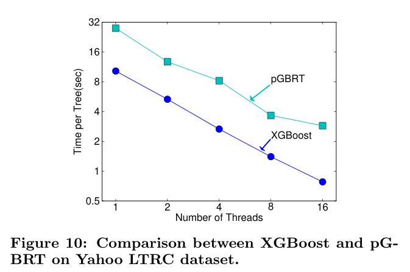
:::

::: {.column width="10%"}
	
:::

::: {.column width="45%"}
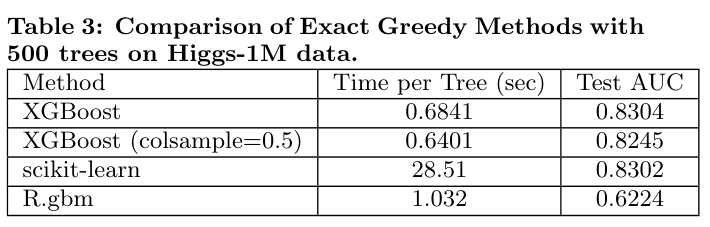
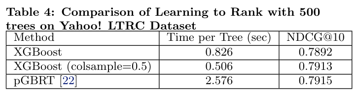
:::

::::

## Conclusion

* Showed that decision trees can be used on big data sets
* Still used by researchers today

:::::

::: {.callout-tip}
# Paper Advice

* Follow the article type and journal format specifications closely
* Ensure that key aspects of the study are simply laid out and easy to find.
* Write the paper as a clear, sensical story that reviewers can follow easily. 
* Don’t be afraid to state the study’s limitations.
* Design figures to help explain complicated concepts.

--- "[Think Like a Reviewer](https://www.linkedin.com/pulse/think-like-reviewer-make-your-paper-easy-evaluate-publish-able-x23ue/?trackingId=Eo8uLVToR3iFiPkVNgppGw%3D%3D)" by Dr Miriam Segura, editor-in-chief of *CBE-Life*
:::

# SHAP Values

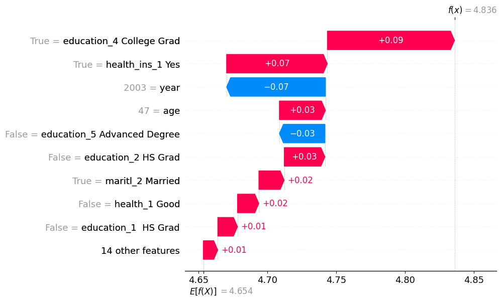

# Quo Vadimus?

:::: {.columns}

::: {.column width="40%"}
* due this Friday:

    - Precept 4
    - Team Charter

:::

::: {.column width="10%"}
	
:::

::: {.column width="50%"}
Midsemester Project

* due Oct 9:

  * Precept 5
  * Slides as Outline
  
* due Oct 16:

  * Report
  * Poster
  * Video

:::

::::


# Footnotes

::: {.callout-note collapse="true"}

## (optional) Additional Resources and References

* [Bagging vs Boosting](https://medium.com/@roshmitadey/bagging-v-s-boosting-be765c970fd1) by Roshmita Dey
* [XGBoost](https://xgboost.readthedocs.io/en/stable/tutorials/model.html)

:::

::: {.callout-note collapse="true"}
## Session Info

```{r}
sessionInfo()
```
:::


:::: {.columns}

::: {.column width="45%"}
	
:::

::: {.column width="10%"}
	
:::

::: {.column width="45%"}

:::

::::

::::: {.panel-tabset}


:::::